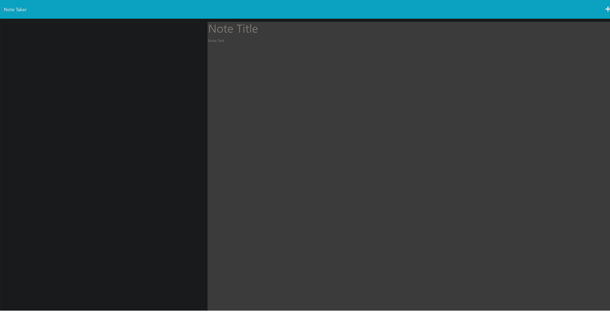

# Note Taker

## Description 
Note Taking Application
This is a simple note-taking application built with Node.js and Express. It allows users to create, view, and delete notes. The notes are stored in a JSON file on the server.

## Installation
1. Clone the repository to your local machine:

git clone <repository-url>

2. Navigate to the project directory:

cd note-taking-app

3. Install the dependencies using npm:

npm install

## screenshots

## Usage

Start the application:

Copy code
npm start
The application will start running on http://localhost:3001.

Open your web browser and navigate to http://localhost:3001.

The home page will display a list of existing notes (if any). You can click on a note to view its details.

To create a new note, click on the "New Note" button and fill in the title and content of the note.

To delete a note, click on the "Delete" button next to the note.

Folder Structure
The project has the following folder structure:

db/: Contains the db.json file where the notes are stored.
public/: Contains the static files (HTML, CSS, JavaScript) for the front-end.
routes/: Contains the route handlers for the different endpoints.
index.js: Handles the home page and default routes.
notes.js: Handles the API routes for creating, reading, and deleting notes.
server.js: The main entry point of the application.
Dependencies
The application uses the following dependencies:

express
uuid

License
This project is licensed under the MIT License. See the LICENSE file for more information.

